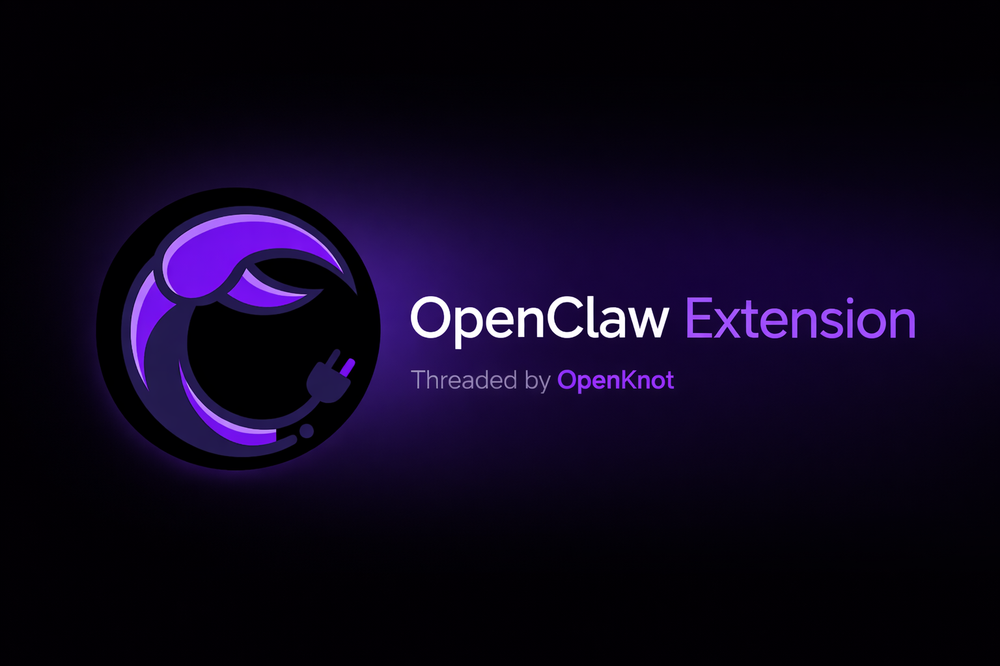

# OpenClaw VS Code Extension

VS Code status bar shortcut for connecting to OpenClaw. It shows connection state and runs your configured OpenClaw CLI command in a terminal.

Quick, super-simple overview: see `SUMMARY.md`.

## Features

- **`Status Bar Indicator`:** Shows idle, connecting, connected, and error states at a glance.
- **`One-Click Connect`:** Runs your OpenClaw command in a dedicated terminal.
- **`Terminal Reuse`:** Keeps a single terminal session for quick reconnects.
- **`Auto-Connect`:** Optionally connect on startup.
- **`Custom Command`:** Configure the exact command for your environment.
- **`Guided Setup`:** Install Node.js and OpenClaw with prompts.
- **`Install Shortcuts`:** One-click install or copy commands when the CLI is missing.
- **`Legacy Migration`:** Prompts to upgrade from `molt`/`clawdbot` to `openclaw`.
- **`Node Check`:** Detects missing Node.js and offers installers.

## Quick Start (macOS + Windows)

### 1. Install Node.js (*required*)

- Download the latest LTS from https://nodejs.org
- **Verify**: `node -v` shows `v22.x` or newer

### 2. Install OpenClaw

```
npm install -g openclaw@latest
```

> **Verify**: `openclaw --help`

### 3. Onboard and start the Gateway

```
openclaw onboard --install-daemon
openclaw gateway --port 18789
```

**Open Dashboard**: `http://127.0.0.1:18789/`

### 4. Log in to a channel (*optional*)

```
openclaw channels login
```

Scan the QR (WhatsApp) or follow the prompt for your channel.

### 5. Connect from VS Code

Click the `OpenClaw` status bar item. The extension sends your configured command in the terminal.

## Beginner-Friendly Setup

If you see a "command not found: openclaw" error in VS Code, use the built-in helpers:

- Run `OpenClaw: Setup` from the Command Palette; OR
- Click the action buttons in the error message to install or copy the command

The setup flow can also detect missing Node.js, guide you to install the latest LTS, and then install OpenClaw.

## Configuration

- `openclaw.autoConnect`: Automatically connect on startup (default: false)
- `openclaw.command`: Command to run when connecting (default: `openclaw status`)

For Windows with WSL, set: `openclaw.command` = `wsl openclaw status`

## Model Setup (Beginner-Friendly)

By default, OpenClaw uses its bundled Pi binary in RPC mode. If you want a different provider or custom settings, update your config:

`~/.openclaw/openclaw.json`

> See the OpenClaw docs for configuration examples and provider setup: https://docs.openclaw.ai

## Troubleshooting

### "command not found: openclaw"

- Reinstall CLI: `npm install -g openclaw@latest`
- Restart your terminal or VS Code
- Or run `OpenClaw: Setup` in VS Code to use the guided installer

### Legacy CLI name (molt or clawdbot)

If you previously installed the legacy CLI, update to the new `openclaw` name using the installer or npm, then run `openclaw doctor`:

- Recommended (macOS/Linux): `curl -fsSL https://openclaw.bot/install.sh | bash`
- Global npm: `npm install -g openclaw@latest`

> *See https://docs.openclaw.ai/install/updating for full update guidance.*

### "node: command not found" or Node too old

- Install the latest LTS from https://nodejs.org/
- Verify with `node -v` (needs v22+)

### Gateway not running

- **Run**: `openclaw gateway --port 18789`
- **Open**: `http://127.0.0.1:18789/`

### No status bar item

- Ensure you are in the Extension Development Host when testing
- Check Output panel for extension logs

### Windows + WSL

- Set `openclaw.command` to `wsl openclaw status`

## Development

1. Install dependencies: `bun install`
2. Compile: `bun run compile`
3. Press F5 to launch the Extension Development Host

## License

[MIT](./LICENSE)
