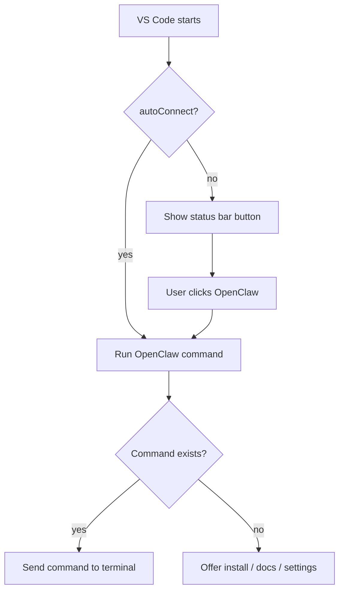
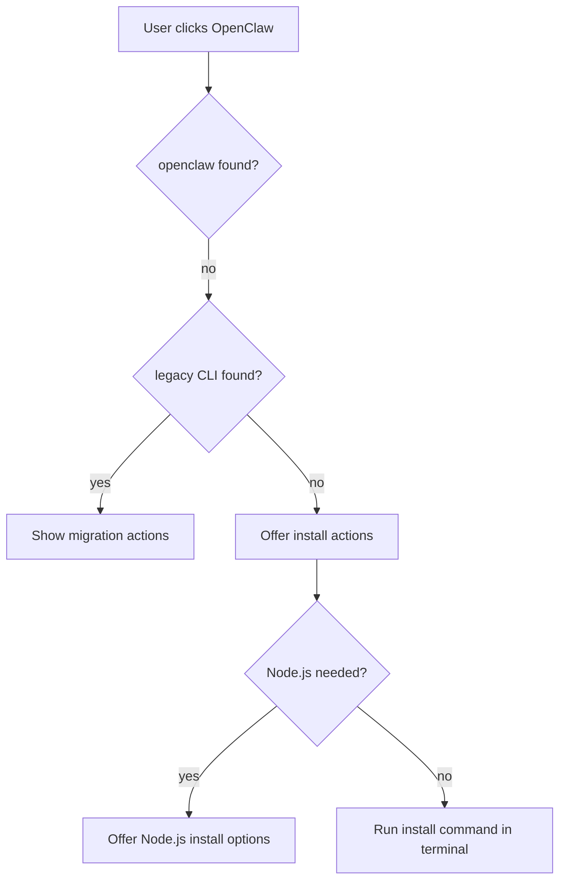
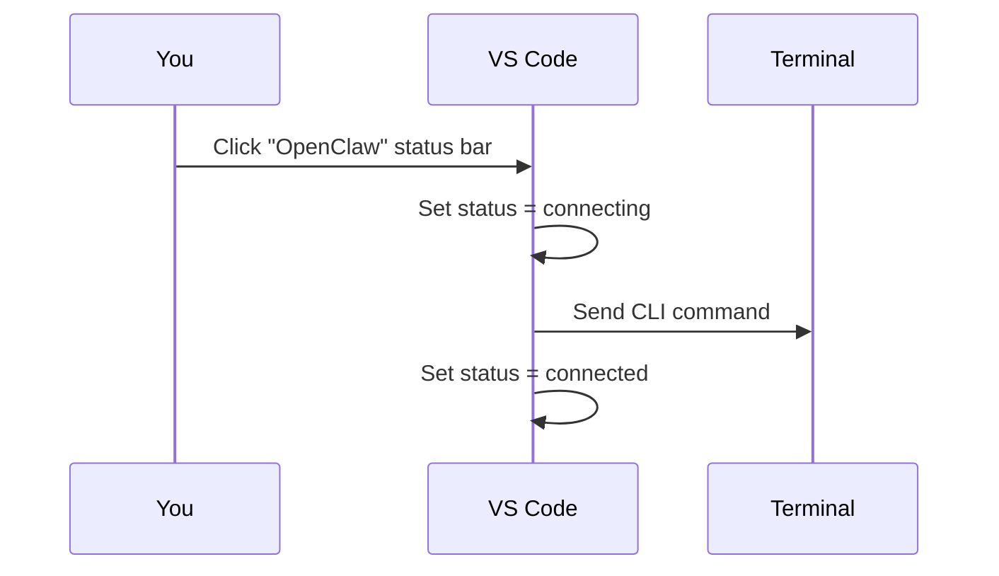

# OpenClaw Extension Summary (Super Simple)

This extension adds a single "OpenClaw" status bar button in VS Code.
Click it to run your OpenClaw CLI command in a terminal.

## What It Does

- Shows connection state in the status bar (idle, connecting, connected, error)
- Runs your configured OpenClaw CLI command in a dedicated terminal
- Can auto-connect on startup
- Helps install Node.js / OpenClaw if missing
- Guides migration from legacy CLI names

## How To Use (The Simplest Path)

1. Install OpenClaw CLI:
   - `npm install -g openclaw@latest`
2. Start the gateway:
   - `openclaw gateway --port 18789`
3. Click the `OpenClaw` status bar item in VS Code.
4. The extension sends your command (default: `openclaw status`).

That's it. If the command is missing, the extension offers install actions.

## Commands You Use in VS Code

- `OpenClaw: Connect` (runs your command)
- `OpenClaw: Setup` (guided install for Node.js and OpenClaw)

## Settings (Optional)

- `openclaw.command`
  - Default: `openclaw status`
  - Example for WSL on Windows: `wsl openclaw status`
- `openclaw.autoConnect`
  - `true` to auto-run on startup

## Status Bar States

- `$(plug) OpenClaw` = idle (click to connect)
- `$(sync~spin) OpenClaw` = connecting
- `$(check) OpenClaw` = connected (command sent)
- `$(alert) OpenClaw` = error (click to retry)

## Simple Flow Diagram

## Setup Helper Flow (Missing CLI / Node)

## What You See When It Works

## Troubleshooting (Short Version)

- "command not found: openclaw"
  - Run `OpenClaw: Setup` or reinstall:
  - `npm install -g openclaw@latest`
- "node: command not found"
  - Install latest Node.js LTS from https://nodejs.org/
- Want different CLI command?
  - Update `openclaw.command` in Settings

## ELI5

Click the status bar button and the extension runs your OpenClaw CLI command for you.
